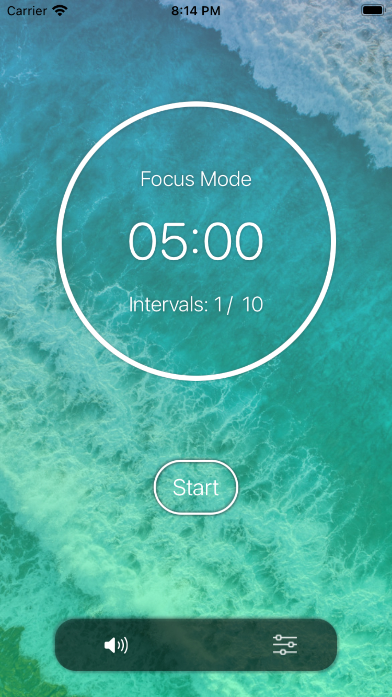

### Hi I'm Vinh, a doctor on the way to become an iOS developer.

 

Hi there, I'm Vinh, I'm currently a doctor. I'm being on the journey to become an iOS developer. It's a rough path but also intriguing.  I like to make app that people love to use.

#   Focus In Nature

Minimalist pomodoro timer, with nature sounds, notification, taptic feedback

&nbsp;&nbsp;&nbsp;&nbsp;&nbsp;

#   Focus In Nature

Minimalist pomodoro timer, with nature sounds, notification, taptic feedback

&nbsp;&nbsp;&nbsp;&nbsp;&nbsp;

